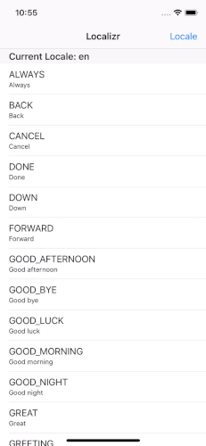

# Localizr.swift

[](https://travis-ci.org/michaelhenry/Localizr.swift)
[](https://cocoapods.org/pods/Localizr.swift)
[](https://cocoapods.org/pods/Localizr.swift)
[](https://cocoapods.org/pods/Localizr.swift)




## Example

To run the example project, clone the repo, and run `pod install` from the Example directory first.

I did not write anything to all **Localizable.strings** files that can be found in [Locales folder](Example/Localizr-iOS/Locales) so that you could see how it was generated and sync using the [Localizr server](https://github.com/michaelhenry/localizr) when you start to run this example project.

You can check the Project's **Build Phases > Run Script** and see how I curl the data from the [Localizr server](https://github.com/michaelhenry/localizr). I do recommend to do this using CI for adhoc build distribution(not development/appstore/testflight build distribution).


## Requirements

## Installation

Localizr.swift is available through [CocoaPods](https://cocoapods.org). To install
it, simply add the following line to your Podfile:

```ruby
pod 'Localizr.swift'
```

## How to use it.

```swift
import Localizr_swift

```

To show all supported localization
```swift
Localizr.supportedLocales()

```

To update the current localization
```swift
Localizr.update(locale: "en")

```

To get the current localization
```swift
Localizr.currentLocale()

```

To show the localized value
```swift
"HELLO_WORLD".localized()

```


## Author

Michael Henry Pantaleon, me@iamkel.net

## License

Localizr.swift is available under the MIT license. See the LICENSE file for more info.
